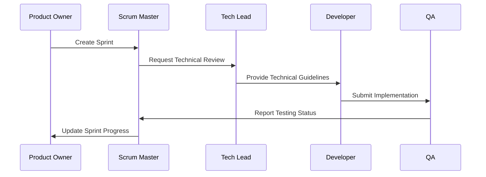

# Agile Roo Modes Collection

A collection of custom Roo modes that work together as an agile team. This collection enables multiple developers and AI agents to collaborate effectively on large projects by providing specialized roles with clear responsibilities and interaction patterns.

## Available Modes

### Product Owner Mode
- Backlog management and prioritization
- User story creation and refinement
- Product roadmap maintenance
- Stakeholder collaboration
- Feature prioritization

### Scrum Master Mode
- Sprint planning and management
- Team velocity tracking
- Process improvement
- Scrum ceremonies facilitation
- Impediment removal

### Tech Lead Mode (modified default architect)
- Technical decision making
- Architecture review and planning
- Code standards enforcement
- Technical debt management
- Design pattern guidance

### Developer Mode (modified default code)
- Code implementation
- Unit testing
- Code review
- Technical documentation
- Bug fixing

### QA Mode
- Test strategy development
- Test case management
- Quality metrics tracking
- Bug reporting and verification
- Release validation

## Setup and Configuration

1. **Prerequisites**
   - Get a Jira API key from your Atlassian cloud account
   - Generate a GitHub personal access token
   - Install the required MCP servers:
     ```bash
     # For Jira integration
     uvx mcp-atlassian --jira-url=https://your-domain.atlassian.net \
                       --jira-username=your-email@domain.com \
                       --jira-token=YOUR_TOKEN

     # For GitHub integration
     docker pull ghcr.io/github/github-mcp-server
     ```

2. **Installation**
   Run the Python installer script to set up the custom modes in your project:
   ```bash
   ./modes_installer.py --target /path/to/your/project
   ```

   This will:
   - Create the .roomodes file with custom modes
   - Copy the roorules files to your project root
   - Set up MCP configuration for Jira and GitHub

3. **Configuration**
   - Update `.roo/mcp.json` with your Jira and GitHub credentials
   - Customize mode rules in `.roorules-*` files if needed
   - Adjust file access permissions in mode definitions if required

## Mode Interaction Patterns



## Best Practices

## Development Guidelines

### Adding New Modes
1. Create mode configuration in `modes/`
2. Define mode rules in `roorules/`
3. Update installer script
4. Document mode interactions

### Customizing Existing Modes
1. Modify mode JSON configuration
2. Update corresponding roorules
3. Test mode interactions
4. Update documentation


## License

MIT License - See [LICENSE](LICENSE) for details
